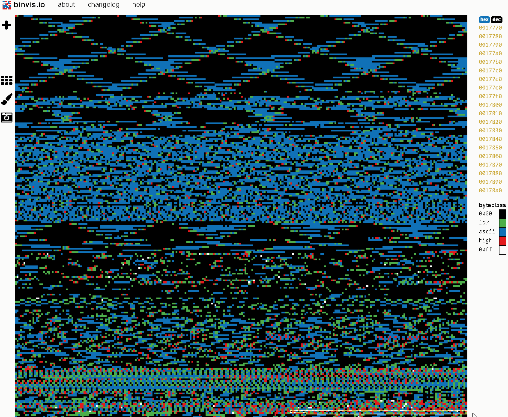

# HP Enterprise AHS (Active Health System) File analyser

This program can open AHS files and extract some of the data from it.

It is hoped that eventually all data from the files can be read and analysed, and that this code might be ported to the browser so that it can be accessed easily.

## Prepare

Save any .ahs files into the "data" folder in the root of this repository.

## Run

There is a (Work in Progress) JavaScript decoder, which runs on [Node.js](https://nodejs.org/).

First use the [NPM](https://www.npmjs.com/) command to download all dependencies:

```bash
npm install
```

Then run the ahs-extract.js script to extract the files:

```bash
node ./ahs-extract.js -e ./data/HPE_<serial>_<date>.ahs
```

#### Usage

```
Usage: ahs-extract [options] <file>

Options:
  -V, --version    output the version number
  -e, --extract    save extracted files
  -j, --json       save parsed files
  -o, --overwrite  overwrite existing files
  -c, --checksum   print checksums
  -v, --verbose    verbose output
  -h, --help       output usage information
```

----

## Files

A typical AHS file might look like the following when extracted:

```powershell
Mode                LastWriteTime         Length Name
----                -------------         ------ ----
-a----        9/09/2019   3:52 PM        5198302 0002067-2018-10-26.bb
-a----        9/09/2019   3:52 PM        4166491 0002377-2019-08-28.bb
-a----        9/09/2019   3:52 PM        5311945 0002379-2019-08-30.bb
-a----        9/09/2019   3:52 PM        5266570 0002380-2019-08-31.bb
-a----        9/09/2019   3:52 PM        5180606 0002381-2019-09-01.bb
-a----        9/09/2019   3:52 PM        5343054 0002382-2019-09-02.bb
-a----        9/09/2019   3:52 PM        5216706 0002383-2019-09-03.bb
-a----        9/09/2019   3:52 PM        5174511 0002384-2019-09-04.bb
-a----        9/09/2019   3:52 PM         660433 0002385-2019-09-05.bb
-a----        9/09/2019   3:52 PM          27937 bcert.pkg.xml
-a----        9/09/2019   3:52 PM            780 clist.pkg
-a----        9/09/2019   3:52 PM            876 counters.pkg
-a----        9/09/2019   3:52 PM            823 CUST_INFO.DAT
-a----        9/09/2019   3:52 PM        4173447 d011418.bb
-a----        9/09/2019   3:52 PM        2732930 d043018.bb
-a----        9/09/2019   3:52 PM        4264801 d062517.bb
-a----        9/09/2019   3:52 PM        4037633 d081117.bb
-a----        9/09/2019   3:52 PM         553114 d102418.bb
-a----        9/09/2019   3:52 PM        2667363 d121817.bb
-a----        9/09/2019   3:52 PM        2078986 d_unkn.bb
-a----        9/09/2019   3:52 PM          41881 file.pkg.txt
-a----        9/09/2019   3:52 PM        3181043 s_unkn.bb
```

The files are as follows:

- bcert.pkg.xml
- file.pkg.txt
- clist.pkg
- counters.pkg
- CUST_INFO.DAT
- *.bb

So far the data in all the files except for the .bb files can be parsed.

### bcert.pkg - BCert (XML)

This file is a gzip compressed XML file, and contains the results of a factory hardware test - lists hardware, firmware versions, test results, etc.

### file.pkg - File (TXT)

This is a plain text file, and contains the output of a directory listing of all files saved to iLO storage.

### clist.pkg - CList (BIN)

This is a small binary file, and contains a list of zbb/bb files - although the list doesn't appear to match up with either the list of .bb files in the .ahs file, or those on the server (as listed in the file file.pkg.txt)

### counters.pkg - Counters (BIN)

This is a small binary file, and contains a few server metrics, mainly regarding issues with writing of the diagnostic data.

### CUST_INFO.DAT - Cust Info (BIN)

This is a binary file, and appears to contain the details the customer filled in when they created the AHS file.

### \*.zbb/\*.bb - Black Box (BIN)

The files with most of the useful data are the .bb files, which are shown at the bottom of this document to be Black Box files. It's these that we need to be able to read in order to make our software useful. The files come gzip compressed in the .ahs file, but the loader script automagically decompresses them.

> Note: There's an irony here with the name. I'm fairly sure HP chose to call these files Black Box files because, like an aeroplane's flight recorder, they capture server metrics that are essential for piecing together why issues such as crashes happen. However, these custom binary files are also a black box because of how opaque they are to casual reading. Why HP didn't choose to use an open ASCII format for saving data to files, like XML, CSV or JSON - or even a widely used binary format such as SQLite, BSON or Python Pickle - is beyond me.

Older .bb files just start with data fields, but newer ones appear to have a header (or it might just be that they start with odd fields). This header looks like it starts with 0x3A if it contains old style data (like the older files without a header), or with 0x3B if the data is in what appears to be a new style (without extensive ascii at the beginning). I wonder if this new style is RedFish's Binary Encoded JSON (BEJ) format, which is used for compression of Redfish Device Enablement (RDE) server data. If this is the case, the key to opening this data would be the JSON schema files that have been extracted from the iLO firmware.

The standard old style .bb files appear to dive straight into the data, with no magic bytes. The first set of fields in a file start with 2 bytes that likely describe the record type, then some unknown bytes, and then a zero padded string for the field name. Strangely the data for each field does not appear to be saved along side the field definition, and my suspicion is that the data is held in blocks throughout the file. So the file likely consists of a set of fields, then a set of values, with the field definitions possibly holding information about the values stored, such as their type and length.

Here are some sample fields, broken down into what I think are their constituent parts:

```
Field Type  ??          ??              Field Name

88          1d          000000000000    49646c655461736b0000000000000000000000000000000000000000000000000000000000000000000000000000000000000000000000000000000000000000000000000000000000000000000000000000000000000000
10001000    00011101                    IdleTask

88          1f          000000000000    694c4f204b65726e656c000000000000000000000000000000000000000000000000000000000000000000000000000000000000000000000000000000000000000000000000000000000000000000000000000000000000
10001000    00011111                    iLO Kernel

84          1d          010024010100    49646c65207365636f6e647320696e20746865206c617374206d696e757465000000000000000000000000000000000000000000000000000000000000000000000000000000000000000000000000000000000000000000
10000100    00011101                    Idle seconds in the last minute

8c          1d          010024010100    49646c65207365636f6e647320696e20746865206c617374206d696e757465000000000000000000000000000000000000000000000000000000000000000000000000000000000000000000000000000000000000000000
10001100    00011101                    Idle seconds in the last minute

8c          1f          010124080300    536c6565702074696d65000000000000000000000000000000000000000000000000000000000000000000000000000000000000000000000000000000000000000000000000000000000000000000000000000000000000
10001100    00011111                    Sleep time

84          1f          020024040300    694c4f204b42425820424f4f54000000000000000000000000000000000000000000000000000000000000000000000000000000000000000000000000000000000000000000000000000000000000000000000000000000
10000100    00011111                    iLO KBBX BOOT

88          0c          000000000000    694c4f204865616c74682053756273797374656d0000000000000000000000000000000000000000000000000000000000000000000000000000000000000000000000000000000000000000000000000000000000000000
10001000    00001100                    iLO Health Subsystem

84          0c          040024040200    506c61744465662053656e736f722053746174650000000000000000000000000000000000000000000000000000000000000000000000000000000000000000000000000000000000000000000000000000000000000000
10000100    00001100                    PlatDef Sensor State

8c          0c          040125020200    5265636f726420494400000000000000000000000000000000000000000000000000000000000000000000000000000000000000000000000000000000000000000000000000000000000000000000000000000000000000
10001100    00001100                    Record ID
```

```
Field Type  ??          ??              ??          Field Name

86          31          000000000000    25140300    53797374656d20426f6172640000000000000000000000000000000000000000
10000110    00110001                                System Board

92          31          000004000000    05000300    4546555345315f50460000000000000000000000000000000000000000000000
10010010    00110001                                EFUSE1_PF

8e          31          000000000000    25010300    4155582f4d61696e20454655534520526567756c61746f722031000000000000
10001110    00110001                                AUX/Main EFUSE Regulator 1

8e          31          010200000000    25010300    50726f636573736f72203300203220526567756c61746f72730061746f727300
10001110    00110001                                Processor 3

8e          02          011400000000    64010300    4d454d494420627974653a203230007500000000000000000000000000000000
10001110    00000010                                MEMID byte: 20

8e          02          011600000000    64010300    4d454d494420627974653a203232007500000000000000000000000000000000
10001110    00000010                                MEMID byte: 22
```

```
Field Type  ??          ??

08          1d          01010001
00001000    00011101
```

```
Field Type  ??          ??

06          52          047656E382076323A00000112C6BC3453040004000000
00000110    01010010
```

The parts of the file that I think hold the data are a little more messy at the moment, and I'm finding it hard to spot a clear structure:

```
3100000000000000000000000000000000000000000000000000000000000000770600000000000000000000000000000000000000000000000000000000000000000000000000000000000000000000000000000000000000000000000000000000000000000000000000000000000000000000000000000000000000000000000000000000000000000000000000000000000000000000000000000000000000000000000000000000000000000000000000000000000000000000000000000000000000000000000000000000000000000000081f032400000000000000000000000000000000000000000000000000000000000000000000000000081f04840140010000010000000000000001000000000000000100000000000000000000000000000000000000000000000000000000000000000000000000000000000000000000000000000000000000000000000000000000000000000000000000000000000000000000000000000000000000000000000000000000000000000000000000000000000000000000000000000080000000aa020000aa02000000010000550100005501000000020000ab000000ab000000000400005500000055000000c00600005100000031000000000800002b0000002b00000000100000f3010000f30100000000000000000000000000000000000000000000000000000000000000000000000000000000000000000000000000000000000000000000000000000000000000000000000000000000000000000000000000000000000000000000000000000000000000000000000000002500000025000000250000002500000023000000020000000000000000000000000000004c000000000000000000000000000000081f011000bd795b01000000008850030000000000081f0500012e600000000000000000000000000000010000000000000000000000000000000000000000000000030000003100000000000000000000000000000000000000000000000000000000000000770600000000000000000000000000000000000000000000000000000000000000000000000000000000000000000000000000000000000000000000000000000000000000000000000000000000000000000000000000000000000000000000000000000000000000000000000000000000000000000000000000000000000000000000000000000000000000000000000000000000000000000000000000000000000000000000000000000000000000000000
```

To help with visualising these files, there are several cool tools we can utilise:

#### [binvis.io](https://binvis.io/)

Using the "scan" plot of binvis.io shows us some pretty patterns, which are caused by the use of fixed length strings:



It looks like the largely blue areas at the top are the field names, and the messy area at the bottom holds the binary values (likely uint32 values).

#### [BinVis](https://code.google.com/archive/p/binvis/)

Taking this further, the BinVis Windows app makes us feel like we're in the Matrix, and also gives us more insight into the structures in our binary file:


#### [Veles](https://codisec.com/veles/)

Veles is a really nice tool, and we can take advantage of both the variable length Hex editor (with colour coded bytes, to align our fixed length fields):


...and a 3D plot that allows us to walk through the binary and see its structure:


----

## iLO

It might be useful to see how iLO creates the .ahs file, and the files inside it (e.g. the .bb and .pkg files). To that end, we can have a sneaky peek inside the iLO firmware to see how HP does its thing.

### Firmware

First, get the latest iLO firmware file. As of the time of writing, it is available here:

[https://support.hpe.com/hpsc/swd/public/detail?swItemId=MTX_a9e1d6870f1543739675cb0620](https://support.hpe.com/hpsc/swd/public/detail?swItemId=MTX_a9e1d6870f1543739675cb0620)

Put the firmware in the "data" folder of this repository.

### BinWalk

Next download Binwalk, a Python library, install its dependencies and then install the library itself (and, obviously, install [Python](https://www.python.org/) if you haven't already):

```bash
mkdir bin

git clone https://github.com/ReFirmLabs/binwalk.git ./bin/binwalk

sudo ./bin/binwalk/deps.sh

sudo python ./bin/binwalk/setup.py install
```

### iLO4 Toolbox

Next install the iLO4 Toolbox, a handy piece of software to help us pull apart the iLO firmware, and install some Ruby dependencies (after installing [Ruby](https://www.ruby-lang.org/) if needed):

```bash
git clone https://github.com/airbus-seclab/ilo4_toolbox.git ./bin/ilo4_toolbox

sudo gem install bindata metasm

pip install idc
```

### Extraction

Now we can start extracting the data we need from the iLO firmware using BinWalk:

#### ilo5_146.fwpkg

```bash
binwalk -e ./data/ilo5_146.fwpkg
```

This gives us the following files:

```powershell
Mode                LastWriteTime         Length Name
----                -------------         ------ ----
-a----       10/09/2019   9:10 PM       17234458 83D.zip
-a----       25/07/2019   4:01 PM       33556520 ilo5_146.bin
-a----       25/07/2019   4:21 PM          42361 ilo5_146.xml
-a----       25/07/2019   4:21 PM            693 payload.json
-a----       24/07/2019   5:05 PM           8106 readme.txt
```

#### ilo5_146.bin

Next we use the iLO Toolkit to extract the iLO binary, ```ilo5_146.bin```:

```bash
python ./bin/ilo4_toolbox/scripts/iLO5/ilo5_extract.py ./data/_ilo5_146.fwpkg.extracted/ilo5_146.bin ./_ilo5_146.fwpkg.extracted/extract
```

This gives us a set of files:

```powershell
Mode                LastWriteTime         Length Name
----                -------------         ------ ----
-a----       10/09/2019   6:06 PM           2048 bootblock.hdr
-a----       10/09/2019   6:06 PM          32768 bootblock.raw
-a----       10/09/2019   6:06 PM            512 bootblock.sig
-a----       10/09/2019   6:06 PM           2048 bootloader1_main.hdr
-a----       10/09/2019   6:06 PM          13220 bootloader1_main.raw
-a----       10/09/2019   6:06 PM            512 bootloader1_main.sig
-a----       10/09/2019   6:06 PM           2048 bootloader1_recovery.hdr
-a----       10/09/2019   6:06 PM           2768 bootloader1_recovery.raw
-a----       10/09/2019   6:06 PM            512 bootloader1_recovery.sig
-a----       10/09/2019   6:06 PM           2048 bootloader2_main.hdr
-a----       10/09/2019   6:06 PM          13220 bootloader2_main.raw
-a----       10/09/2019   6:06 PM            512 bootloader2_main.sig
-a----       10/09/2019   6:06 PM           2048 bootloader2_recovery.hdr
-a----       10/09/2019   6:06 PM           2768 bootloader2_recovery.raw
-a----       10/09/2019   6:06 PM            512 bootloader2_recovery.sig
-a----       10/09/2019   6:06 PM          20480 bootstrap.bin
-a----       10/09/2019   6:06 PM           2048 bootstrap.hdr
-a----       10/09/2019   6:06 PM            512 bootstrap.sig
-a----       10/09/2019   6:07 PM       29326600 elf_main.bin
-a----       10/09/2019   6:06 PM           2048 elf_main.hdr
-a----       10/09/2019   6:06 PM       15503041 elf_main.raw
-a----       10/09/2019   6:06 PM            512 elf_main.sig
-a----       10/09/2019   6:07 PM        4973172 elf_recovery.bin
-a----       10/09/2019   6:07 PM           2048 elf_recovery.hdr
-a----       10/09/2019   6:07 PM        2620088 elf_recovery.raw
-a----       10/09/2019   6:07 PM            512 elf_recovery.sig
-a----       10/09/2019   6:07 PM            573 firmware.map
-a----       10/09/2019   6:06 PM           1184 hpimage.hdr
-a----       10/09/2019   6:06 PM         872832 kernel_main.bin
-a----       10/09/2019   6:06 PM           2048 kernel_main.hdr
-a----       10/09/2019   6:06 PM         546944 kernel_main.raw
-a----       10/09/2019   6:06 PM            512 kernel_main.sig
-a----       10/09/2019   6:06 PM         872832 kernel_recovery.bin
-a----       10/09/2019   6:06 PM           2048 kernel_recovery.hdr
-a----       10/09/2019   6:06 PM         546944 kernel_recovery.raw
-a----       10/09/2019   6:06 PM            512 kernel_recovery.sig
```

#### elf_main.bin

We can now dissect the largest of these files, ```elf_main.bin```:

```bash
ruby ./bin/ilo4_toolbox/scripts/iLO5/dissection.rb ./data/_ilo5_146.fwpkg.extracted/extract/elf_main.bin

mkdir ./data/_ilo5_146.fwpkg.extracted/extract/dissection
mv ./data/_ilo5_146.fwpkg.extracted/extract/loaders ./data/_ilo5_146.fwpkg.extracted/extract/dissection
mv ./data/_ilo5_146.fwpkg.extracted/extract/log ./data/_ilo5_146.fwpkg.extracted/extract/dissection
mv ./data/_ilo5_146.fwpkg.extracted/extract/mods ./data/_ilo5_146.fwpkg.extracted/extract/dissection
mv ./data/_ilo5_146.fwpkg.extracted/extract/scripts ./data/_ilo5_146.fwpkg.extracted/extract/dissection
```

The folder with the code we're looking for is ```mods```:

```powershell
Mode                LastWriteTime         Length Name
----                -------------         ------ ----
-a----       10/09/2019   7:43 PM          24040 .accessmon.elf.RO
-a----       10/09/2019   7:43 PM            388 .accessmon.elf.RW
-a----       10/09/2019   7:43 PM          82264 .amail.elf.RO
-a----       10/09/2019   7:43 PM            780 .amail.elf.RW
-a----       10/09/2019   7:43 PM          45176 .auxvideo.elf.RO
-a----       10/09/2019   7:43 PM           1716 .auxvideo.elf.RW
-a----       10/09/2019   7:43 PM         143208 .backup.elf.RO
-a----       10/09/2019   7:43 PM          11132 .backup.elf.RW
-a----       10/09/2019   7:43 PM         152856 .beacon.elf.RO
-a----       10/09/2019   7:43 PM           3108 .beacon.elf.RW
-a----       10/09/2019   7:43 PM         222120 .blackbox.elf.RO
-a----       10/09/2019   7:43 PM           3356 .blackbox.elf.RW
-a----       10/09/2019   7:43 PM          93128 .blobstore.elf.RO
-a----       10/09/2019   7:43 PM           2052 .blobstore.elf.RW
-a----       10/09/2019   7:43 PM         865944 .bmc.elf.RO
-a----       10/09/2019   7:43 PM          11052 .bmc.elf.RW
-a----       10/09/2019   7:43 PM         868705 .boottable
-a----       10/09/2019   7:43 PM          97992 .canvas.elf.RO
-a----       10/09/2019   7:43 PM           2644 .canvas.elf.RW
-a----       10/09/2019   7:43 PM         447656 .chif.elf.RO
-a----       10/09/2019   7:43 PM          10588 .chif.elf.RW
-a----       10/09/2019   7:43 PM          75448 .cobourg.elf.RO
-a----       10/09/2019   7:43 PM          23156 .cobourg.elf.RW
-a----       10/09/2019   7:43 PM         584440 .ConAppCLI.elf.RO
-a----       10/09/2019   7:43 PM         100412 .ConAppCLI.elf.RW
-a----       10/09/2019   7:43 PM         172120 .dhcp6c.elf.RO
-a----       10/09/2019   7:43 PM           2876 .dhcp6c.elf.RW
-a----       10/09/2019   7:43 PM         166952 .drvsec.elf.RO
-a----       10/09/2019   7:43 PM            772 .drvsec.elf.RW
-a----       10/09/2019   7:43 PM         157032 .dvi.elf.RO
-a----       10/09/2019   7:43 PM          18724 .dvi.elf.RW
-a----       10/09/2019   7:43 PM          43256 .dvrcan.elf.RO
-a----       10/09/2019   7:43 PM           1700 .dvrcan.elf.RW
-a----       10/09/2019   7:43 PM          67592 .dvrdp.elf.RO
-a----       10/09/2019   7:43 PM           2892 .dvrdp.elf.RW
-a----       10/09/2019   7:43 PM          40840 .dvreeprom.elf.RO
-a----       10/09/2019   7:43 PM           2428 .dvreeprom.elf.RW
-a----       10/09/2019   7:43 PM          58088 .dvrespi.elf.RO
-a----       10/09/2019   7:43 PM           2196 .dvrespi.elf.RW
-a----       10/09/2019   7:43 PM          34648 .dvrgpio.elf.RO
-a----       10/09/2019   7:43 PM           4316 .dvrgpio.elf.RW
-a----       10/09/2019   7:43 PM         105400 .dvri2c.elf.RO
-a----       10/09/2019   7:43 PM           2940 .dvri2c.elf.RW
-a----       10/09/2019   7:43 PM          69496 .dvrkcs.elf.RO
-a----       10/09/2019   7:43 PM           1788 .dvrkcs.elf.RW
-a----       10/09/2019   7:43 PM         609688 .dvrmgusb.elf.RO
-a----       10/09/2019   7:43 PM           2708 .dvrmgusb.elf.RW
-a----       10/09/2019   7:43 PM          77992 .dvroverlay.elf.RO
-a----       10/09/2019   7:43 PM           6188 .dvroverlay.elf.RW
-a----       10/09/2019   7:43 PM          75400 .dvrpcievdm.elf.RO
-a----       10/09/2019   7:43 PM           2460 .dvrpcievdm.elf.RW
-a----       10/09/2019   7:43 PM          18568 .dvrsaw.elf.RO
-a----       10/09/2019   7:43 PM           1676 .dvrsaw.elf.RW
-a----       10/09/2019   7:43 PM          16216 .dvrspi.elf.RO
-a----       10/09/2019   7:43 PM           1684 .dvrspi.elf.RW
-a----       10/09/2019   7:43 PM          31064 .dvrsram.elf.RO
-a----       10/09/2019   7:43 PM            476 .dvrsram.elf.RW
-a----       10/09/2019   7:43 PM          17128 .dvrts.elf.RO
-a----       10/09/2019   7:43 PM           1676 .dvrts.elf.RW
-a----       10/09/2019   7:43 PM         314024 .dvrusb.elf.RO
-a----       10/09/2019   7:43 PM          11308 .dvrusb.elf.RW
-a----       10/09/2019   7:43 PM         296296 .embmedia.elf.RO
-a----       10/09/2019   7:43 PM           4868 .embmedia.elf.RW
-a----       10/09/2019   7:43 PM         921480 .ers.elf.RO
-a----       10/09/2019   7:43 PM          18164 .ers.elf.RW
-a----       10/09/2019   7:43 PM         252776 .evlog.elf.RO
-a----       10/09/2019   7:43 PM         190780 .evlog.elf.RW
-a----       10/09/2019   7:43 PM          31240 .evs.elf.RO
-a----       10/09/2019   7:43 PM            476 .evs.elf.RW
-a----       10/09/2019   7:43 PM         360408 .fss.elf.RO
-a----       10/09/2019   7:43 PM          12404 .fss.elf.RW
-a----       10/09/2019   7:43 PM         283448 .fum.elf.RO
-a----       10/09/2019   7:43 PM          13204 .fum.elf.RW
-a----       10/09/2019   7:43 PM         318536 .gpu.elf.RO
-a----       10/09/2019   7:43 PM           5748 .gpu.elf.RW
-a----       10/09/2019   7:43 PM         722904 .health.elf.RO
-a----       10/09/2019   7:43 PM          14852 .health.elf.RW
-a----       10/09/2019   7:43 PM         554280 .json_dsp.elf.RO
-a----       10/09/2019   7:43 PM          53772 .json_dsp.elf.RW
-a----       10/09/2019   7:43 PM         221176 .libc.so.RO
-a----       10/09/2019   7:43 PM           2496 .libc.so.RW
-a----       10/09/2019   7:43 PM         209304 .libevlog.so.RO
-a----       10/09/2019   7:43 PM           1576 .libevlog.so.RW
-a----       10/09/2019   7:43 PM          18624 .libINTEGRITY.so.RO
-a----       10/09/2019   7:43 PM             24 .libINTEGRITY.so.RW
-a----       10/09/2019   7:43 PM        1630552 .libopenssl.so.RO
-a----       10/09/2019   7:43 PM          34364 .libopenssl.so.RW
-a----       10/09/2019   7:43 PM         123352 .libscxx.so.RO
-a----       10/09/2019   7:43 PM            372 .libscxx.so.RW
-a----       10/09/2019   7:43 PM         100120 .network.elf.RO
-a----       10/09/2019   7:43 PM            804 .network.elf.RW
-a----       10/09/2019   7:43 PM         194072 .nicdatasvc.elf.RO
-a----       10/09/2019   7:43 PM           2020 .nicdatasvc.elf.RW
-a----       10/09/2019   7:43 PM         152904 .nvdimm.elf.RO
-a----       10/09/2019   7:43 PM           5004 .nvdimm.elf.RW
-a----       10/09/2019   7:43 PM          89368 .pjfs.elf.RO
-a----       10/09/2019   7:43 PM           2044 .pjfs.elf.RW
-a----       10/09/2019   7:43 PM         267432 .plat_inv.elf.RO
-a----       10/09/2019   7:43 PM          11556 .plat_inv.elf.RW
-a----       10/09/2019   7:43 PM         115448 .plat_telem.elf.RO
-a----       10/09/2019   7:43 PM            556 .plat_telem.elf.RW
-a----       10/09/2019   7:43 PM         532680 .pmci.elf.RO
-a----       10/09/2019   7:43 PM           3700 .pmci.elf.RW
-a----       10/09/2019   7:43 PM         465080 .pwrmgr.elf.RO
-a----       10/09/2019   7:43 PM          28020 .pwrmgr.elf.RW
-a----       10/09/2019   7:43 PM          22360 .rbsu.elf.RO
-a----       10/09/2019   7:43 PM         131908 .rbsu.elf.RW
-a----       10/09/2019   7:43 PM         235432 .rckmgmt.elf.RO
-a----       10/09/2019   7:43 PM           4932 .rckmgmt.elf.RW
-a----       10/09/2019   7:43 PM          39784 .rdp.elf.RO
-a----       10/09/2019   7:43 PM            476 .rdp.elf.RW
-a----       10/09/2019   7:43 PM          90456 .restdir.elf.RO
-a----       10/09/2019   7:43 PM           1228 .restdir.elf.RW
-a----       10/09/2019   7:43 PM         129544 .restevents.elf.RO
-a----       10/09/2019   7:43 PM           1204 .restevents.elf.RW
-a----       10/09/2019   7:43 PM        5407976 .restserver.elf.RO
-a----       10/09/2019   7:43 PM          36508 .restserver.elf.RW
-a----       10/09/2019   7:43 PM         114376 .resttasks.elf.RO
-a----       10/09/2019   7:43 PM            876 .resttasks.elf.RW
-a----       10/09/2019   7:43 PM         797400 .ribcl.elf.RO
-a----       10/09/2019   7:43 PM         133292 .ribcl.elf.RW
-a----       10/09/2019   7:43 PM         128024 .romchf.elf.RO
-a----       10/09/2019   7:43 PM           2700 .romchf.elf.RW
-a----       10/09/2019   7:43 PM          48360 .rsyslog.elf.RO
-a----       10/09/2019   7:43 PM            652 .rsyslog.elf.RW
-a----       10/09/2019   7:43 PM          56008 .rtc.elf.RO
-a----       10/09/2019   7:43 PM           1892 .rtc.elf.RW
-a----       10/09/2019   7:43 PM          38116 .secinfo
-a----       10/09/2019   7:43 PM         715528 .secmgr.elf.RO
-a----       10/09/2019   7:43 PM          18316 .secmgr.elf.RW
-a----       10/09/2019   7:43 PM          60664 .securestart.elf.RO
-a----       10/09/2019   7:43 PM           2580 .securestart.elf.RW
-a----       10/09/2019   7:43 PM          16291 .shstrtab
-a----       10/09/2019   7:43 PM         696632 .snmp.elf.RO
-a----       10/09/2019   7:43 PM          36620 .snmp.elf.RW
-a----       10/09/2019   7:43 PM          64344 .sntp.elf.RO
-a----       10/09/2019   7:43 PM           1092 .sntp.elf.RW
-a----       10/09/2019   7:43 PM         149928 .ssh.elf.RO
-a----       10/09/2019   7:43 PM           3244 .ssh.elf.RW
-a----       10/09/2019   7:43 PM         114376 .stackvas.elf.RO
-a----       10/09/2019   7:43 PM           2268 .stackvas.elf.RW
-a----       10/09/2019   7:43 PM         160920 .svcsHost.elf.RO
-a----       10/09/2019   7:43 PM           2516 .svcsHost.elf.RW
-a----       10/09/2019   7:43 PM         176248 .svcsILO.elf.RO
-a----       10/09/2019   7:43 PM          10436 .svcsILO.elf.RW
-a----       10/09/2019   7:43 PM         111448 .svcslic.elf.RO
-a----       10/09/2019   7:43 PM           4356 .svcslic.elf.RW
-a----       10/09/2019   7:43 PM         100344 .uefi.elf.RO
-a----       10/09/2019   7:43 PM           2196 .uefi.elf.RW
-a----       10/09/2019   7:43 PM         113544 .usbfp.elf.RO
-a----       10/09/2019   7:43 PM            612 .usbfp.elf.RW
-a----       10/09/2019   7:43 PM          35640 .VComCShared_RM.so.RO
-a----       10/09/2019   7:43 PM            112 .VComCShared_RM.so.RW
-a----       10/09/2019   7:43 PM         118232 .vrd.elf.RO
-a----       10/09/2019   7:43 PM          12572 .vrd.elf.RW
-a----       10/09/2019   7:43 PM         122184 .vsp.elf.RO
-a----       10/09/2019   7:43 PM           3508 .vsp.elf.RW
-a----       10/09/2019   7:43 PM        3528504 .webserv.elf.RO
-a----       10/09/2019   7:43 PM           6924 .webserv.elf.RW
-a----       10/09/2019   7:43 PM          20040 .wol.elf.RO
-a----       10/09/2019   7:43 PM            284 .wol.elf.RW
```

We could now BinWalk these files to extract any useful contents, although because BinWalk carves out files these extracted files they will be much larger than expected and each one will contain all decompressed data from the beginning of the internal file inside to the end of the parent file.

Therefore, this repo contains a file that will extract the gzip compressed files from each elf binary. The most interesting two files to extract the contents of are ```.webserver.elf.RO``` and ```.restserver.elf.RO```.

Then use an archive extractor like 7-zip to extract each file and delete the original .gz files afterwards. 7-zip will probably complain about these files (there's an issue with file endings that hasn't been resolved), but nevertheless will extract them.

#### .restserver.elf.RO

```bash
node ./elf-extract-gzip.js -e ./data/_ilo5_146.fwpkg.extracted/extract/dissection/mods/.restserver.elf.RO
```

```powershell
Mode                LastWriteTime         Length Name
----                -------------         ------ ----
-a----       26/07/2019   2:45 AM          16667 AccountService.json
-a----       26/07/2019   2:45 AM          24141 Base.json
-a----       26/07/2019   2:45 AM           2609 Certificate.json
-a----       26/07/2019   2:45 AM           1898 CertificateCollection.json
-a----       26/07/2019   2:45 AM          10656 Chassis.json
-a----       26/07/2019   2:45 AM           1964 ChassisCollection.json
-a----       26/07/2019   2:45 AM          25967 ComputerSystem.json
-a----       26/07/2019   2:45 AM           1978 ComputerSystemCollection.json
-a----       26/07/2019   2:45 AM           6512 Drive.json
-a----       26/07/2019   2:45 AM          19542 EthernetInterface.json
-a----       26/07/2019   2:45 AM           1984 EthernetInterfaceCollection.json
-a----       26/07/2019   2:45 AM           6924 Event.json
-a----       26/07/2019   2:45 AM           4125 EventDestination.json
-a----       26/07/2019   2:45 AM           1982 EventDestinationCollection.json
-a----       26/07/2019   2:45 AM          12882 EventService.json
-a----       26/07/2019   2:45 AM           4268 ExtendedInfo.json
-a----       26/07/2019   2:45 AM          10680 HostInterface.json
-a----       26/07/2019   2:45 AM           2138 HostInterfaceCollection.json
-a----       26/07/2019   2:45 AM          10687 HpeAdvancedMemoryProtection.json
-a----       26/07/2019   2:45 AM          10417 HpeBaseNetworkAdapter.json
-a----       26/07/2019   2:45 AM           1992 HpeBaseNetworkAdapterCollection.json
-a----       26/07/2019   2:45 AM           3523 HpeBaseNetworkAdapterExt.json
-a----       26/07/2019   2:45 AM          10375 HpeCertAuth.json
-a----       26/07/2019   2:45 AM           2103 HpeCertificate.json
-a----       26/07/2019   2:45 AM           1904 HpeCertificateCollection.json
-a----       26/07/2019   2:45 AM           7108 HpeCommon.json
-a----       26/07/2019   2:45 AM           5222 HpeComponent.json
-a----       26/07/2019   2:45 AM           1624 HpeComponentCollection.json
-a----       26/07/2019   2:45 AM          11514 HpeComponentInstallSet.json
-a----       26/07/2019   2:45 AM           1411 HpeComponentInstallSetCollection.json
-a----       26/07/2019   2:45 AM           1941 HpeComponentRepositoryInformation.json
-a----       26/07/2019   2:45 AM           7577 HpeComponentUpdateTask.json
-a----       26/07/2019   2:45 AM           1421 HpeComponentUpdateTaskQueueCollection.json
-a----       26/07/2019   2:45 AM          40900 HpeComputerSystemExt.json
-a----       26/07/2019   2:45 AM          10175 HpeDcpmmDiags.json
-a----       26/07/2019   2:45 AM           1304 HpeDirectoryGroup.json
-a----       26/07/2019   2:45 AM          11035 HpeDirectoryTest.json
-a----       26/07/2019   2:45 AM           8968 HpeESKM.json
-a----       26/07/2019   2:45 AM           3840 HpeEvent.json
-a----       26/07/2019   2:45 AM           2300 HpeEventDestination.json
-a----       26/07/2019   2:45 AM           5751 HpeEventService.json
-a----       26/07/2019   2:45 AM          14813 HpeHttpsCert.json
-a----       26/07/2019   2:45 AM          37778 HpeiLO.json
-a----       26/07/2019   2:45 AM           5225 HpeiLOAccount.json
-a----       26/07/2019   2:45 AM           1684 HpeiLOAccountCertificateMap.json
-a----       26/07/2019   2:45 AM           2004 HpeiLOAccountCertificateMapCollection.json
-a----       26/07/2019   2:45 AM           9890 HpeiLOAccountService.json
-a----       26/07/2019   2:45 AM           9776 HpeiLOActiveHealthSystem.json
-a----       26/07/2019   2:45 AM           2979 HpeiLOBackupFile.json
-a----       26/07/2019   2:45 AM           1636 HpeiLOBackupFileCollection.json
-a----       26/07/2019   2:45 AM           1689 HpeiLOBackupFilesInformation.json
-a----       26/07/2019   2:45 AM           1595 HpeiLOBackupRestoreService.json
-a----       26/07/2019   2:45 AM           6908 HpeiLODateTime.json
-a----       26/07/2019   2:45 AM            157 HpeiLODriveExt.json
-a----       26/07/2019   2:45 AM           2167 HpeiLOEmbeddedMedia.json
-a----       26/07/2019   2:45 AM          23466 HpeiLOEthernetNetworkInterface.json
-a----       26/07/2019   2:45 AM           3425 HpeiLOFederatedGroupCapping.json
-a----       26/07/2019   2:45 AM           4122 HpeiLOFederationGroup.json
-a----       26/07/2019   2:45 AM           1992 HpeiLOFederationGroupCollection.json
-a----       26/07/2019   2:45 AM           2772 HpeiLOFederationPeers.json
-a----       26/07/2019   2:45 AM           1992 HpeiLOFederationPeersCollection.json
-a----       26/07/2019   2:45 AM           4193 HpeiLOFrus.json
-a----       26/07/2019   2:45 AM           1970 HpeiLOFrusCollection.json
-a----       26/07/2019   2:45 AM           4738 HpeiLOGUIService.json
-a----       26/07/2019   2:45 AM          15208 HpeiLOLicense.json
-a----       26/07/2019   2:45 AM           1976 HpeiLOLicenseCollection.json
-a----       26/07/2019   2:45 AM           8056 HpeiLOManagerNetworkService.json
-a----       26/07/2019   2:45 AM           2842 HpeiLOResourceDirectory.json
-a----       26/07/2019   2:45 AM           2457 HpeiLOSecurityDashboard.json
-a----       26/07/2019   2:45 AM           3905 HpeiLOSecurityParam.json
-a----       26/07/2019   2:45 AM           1937 HpeiLOSecurityParamCollection.json
-a----       26/07/2019   2:45 AM          17589 HpeiLOServiceExt.json
-a----       26/07/2019   2:45 AM           7056 HpeiLOSession.json
-a----       26/07/2019   2:45 AM           1442 HpeiLOSessionsSummary.json
-a----       26/07/2019   2:45 AM          12522 HpeiLOSnmpService.json
-a----       26/07/2019   2:45 AM           1276 HpeiLOSnmpServiceExt.json
-a----       26/07/2019   2:45 AM           1939 HpeiLOSoftwareInventory.json
-a----       26/07/2019   2:45 AM          20812 HpeiLOSSO.json
-a----       26/07/2019   2:45 AM          22079 HpeiLOUpdateServiceExt.json
-a----       26/07/2019   2:45 AM           1458 HpeiLOViewPost.json
-a----       26/07/2019   2:45 AM           6394 HpeiLOVirtualMedia.json
-a----       26/07/2019   2:45 AM           2092 HpeInvalidImage.json
-a----       26/07/2019   2:45 AM           1392 HpeInvalidImageCollection.json
-a----       26/07/2019   2:45 AM           3659 HpeLogEntry.json
-a----       26/07/2019   2:45 AM           2454 HpeMaintenanceWindow.json
-a----       26/07/2019   2:45 AM           1635 HpeMaintenanceWindowCollection.json
-a----       26/07/2019   2:45 AM           1195 HpeMemoryChunksExt.json
-a----       26/07/2019   2:45 AM           6689 HpeMemoryExt.json
-a----       26/07/2019   2:45 AM          17650 HpeNetworkAdapter.json
-a----       26/07/2019   2:45 AM           1818 HpeNetworkAdapterStatus.json
-a----       26/07/2019   2:45 AM           6755 HpeNetworkDeviceFunction.json
-a----       26/07/2019   2:45 AM           1760 HpeNetworkInterfaceStatus.json
-a----       26/07/2019   2:45 AM           6804 HpeNetworkPort.json
-a----       26/07/2019   2:45 AM          21343 HpeNetworkPortEVB.json
-a----       26/07/2019   2:45 AM          25913 HpeNetworkPortLLDP.json
-a----       26/07/2019   2:45 AM           6982 HpePowerMeter.json
-a----       26/07/2019   2:45 AM           9915 HpePowerMetricsExt.json
-a----       26/07/2019   2:45 AM          12670 HpeProcessorExt.json
-a----       26/07/2019   2:45 AM          18260 HpeRemoteSupport.json
-a----       26/07/2019   2:45 AM           1741 HpeSeaOfSensors.json
-a----       26/07/2019   2:45 AM           7305 HpeSecurityService.json
-a----       26/07/2019   2:45 AM           5912 HpeServerAccHddService.json
-a----       26/07/2019   2:45 AM          10443 HpeServerAccHddZone.json
-a----       26/07/2019   2:45 AM          13936 HpeServerAccPowerCalibration.json
-a----       26/07/2019   2:45 AM           9419 HpeServerAccPowerLimit.json
-a----       26/07/2019   2:45 AM           2540 HpeServerAccPowerNodesInfo.json
-a----       26/07/2019   2:45 AM           4269 HpeServerAccPowerService.json
-a----       26/07/2019   2:45 AM           9412 HpeServerAccPowerZone.json
-a----       26/07/2019   2:45 AM          27785 HpeServerChassis.json
-a----       26/07/2019   2:45 AM           6123 HpeServerDevice.json
-a----       26/07/2019   2:45 AM           1975 HpeServerDeviceCollection.json
-a----       26/07/2019   2:45 AM           2098 HpeServerFan.json
-a----       26/07/2019   2:45 AM           7440 HpeServerPciDevice.json
-a----       26/07/2019   2:45 AM           1986 HpeServerPciDeviceCollection.json
-a----       26/07/2019   2:45 AM           7173 HpeServerPCISlot.json
-a----       26/07/2019   2:45 AM           1982 HpeServerPCISlotCollection.json
-a----       26/07/2019   2:45 AM           4415 HpeServerPowerSupply.json
-a----       26/07/2019   2:45 AM           2181 HpeSmartStorage.json
-a----       26/07/2019   2:45 AM          33201 HpeSmartStorageArrayController.json
-a----       26/07/2019   2:45 AM           2010 HpeSmartStorageArrayControllerCollection.json
-a----       26/07/2019   2:45 AM          15424 HpeSmartStorageDiskDrive.json
-a----       26/07/2019   2:45 AM           1998 HpeSmartStorageDiskDriveCollection.json
-a----       26/07/2019   2:45 AM           4002 HpeSmartStorageHostBusAdapter.json
-a----       26/07/2019   2:45 AM           2008 HpeSmartStorageHostBusAdapterCollection.json
-a----       26/07/2019   2:45 AM          22856 HpeSmartStorageLogicalDrive.json
-a----       26/07/2019   2:45 AM           2004 HpeSmartStorageLogicalDriveCollection.json
-a----       26/07/2019   2:45 AM           7204 HpeSmartStorageStorageEnclosure.json
-a----       26/07/2019   2:45 AM           2012 HpeSmartStorageStorageEnclosureCollection.json
-a----       26/07/2019   2:45 AM           3328 HpeSNMPAlertDestination.json
-a----       26/07/2019   2:45 AM           1991 HpeSNMPAlertDestinationCollection.json
-a----       26/07/2019   2:45 AM           4653 HpeSNMPUser.json
-a----       26/07/2019   2:45 AM           1969 HpeSNMPUsersCollection.json
-a----       26/07/2019   2:45 AM           1050 HpeTrustedModuleExt.json
-a----       26/07/2019   2:45 AM           3423 HpeUSBDevice.json
-a----       26/07/2019   2:45 AM           2151 HpeUSBDevicesCollection.json
-a----       26/07/2019   2:45 AM           4975 HpeUSBPort.json
-a----       26/07/2019   2:45 AM           1972 HpeUSBPortsCollection.json
-a----       26/07/2019   2:45 AM           4852 HpeWorkloadPerformanceAdvisor.json
-a----       26/07/2019   2:45 AM           1865 HpeWorkloadPerformanceAdvisorCollection.json
-a----       26/07/2019   2:45 AM          49490 iLO.json
-a----       26/07/2019   2:45 AM         159815 iLOEvents.json
-a----       26/07/2019   2:45 AM           7811 IPAddresses.json
-a----       26/07/2019   2:45 AM           2015 JsonSchemaFile.json
-a----       26/07/2019   2:45 AM           1877 JsonSchemaFileCollection.json
-a----       26/07/2019   2:45 AM           2581 LogEntry.json
-a----       26/07/2019   2:45 AM           1786 LogEntryCollection.json
-a----       26/07/2019   2:45 AM           3734 LogService.json
-a----       26/07/2019   2:45 AM           1970 LogServiceCollection.json
-a----       26/07/2019   2:45 AM          12598 Manager.json
-a----       26/07/2019   2:45 AM           3175 ManagerAccount.json
-a----       26/07/2019   2:45 AM           1978 ManagerAccountCollection.json
-a----       26/07/2019   2:45 AM           1964 ManagerCollection.json
-a----       26/07/2019   2:45 AM          12397 ManagerNetworkProtocol.json
-a----       26/07/2019   2:45 AM          23018 Memory.json
-a----       26/07/2019   2:45 AM           5995 MemoryChunks.json
-a----       26/07/2019   2:45 AM           1896 MemoryChunksCollection.json
-a----       26/07/2019   2:45 AM           1922 MemoryCollection.json
-a----       26/07/2019   2:45 AM           4657 MemoryDomain.json
-a----       26/07/2019   2:45 AM           1904 MemoryDomainCollection.json
-a----       26/07/2019   2:45 AM           6422 MessageRegistry.json
-a----       26/07/2019   2:45 AM           2079 MessageRegistryFile.json
-a----       26/07/2019   2:45 AM           1887 MessageRegistryFileCollection.json
-a----       26/07/2019   2:45 AM          16236 metadata.html
-a----       26/07/2019   2:45 AM          10097 MetricDefinition.json
-a----       26/07/2019   2:45 AM           1904 MetricDefinitionCollection.json
-a----       26/07/2019   2:45 AM           4226 MetricReport.json
-a----       26/07/2019   2:45 AM           1896 MetricReportCollection.json
-a----       26/07/2019   2:45 AM           9833 MetricReportDefinition.json
-a----       26/07/2019   2:45 AM           1916 MetricReportDefinitionCollection.json
-a----       26/07/2019   2:45 AM          16165 NetworkAdapter.json
-a----       26/07/2019   2:45 AM           1997 NetworkAdapterCollection.json
-a----       26/07/2019   2:45 AM          29608 NetworkDeviceFunction.json
-a----       26/07/2019   2:45 AM           2071 NetworkDeviceFunctionCollection.json
-a----       26/07/2019   2:45 AM           3013 NetworkInterface.json
-a----       26/07/2019   2:45 AM           2007 NetworkInterfaceCollection.json
-a----       26/07/2019   2:45 AM          13901 NetworkPort.json
-a----       26/07/2019   2:45 AM           1928 NetworkPortCollection.json
-a----       26/07/2019   2:45 AM           1576 odata_service_doc.html
-a----       26/07/2019   2:45 AM          29699 Power.json
-a----       26/07/2019   2:45 AM           7983 Processor.json
-a----       26/07/2019   2:45 AM           1968 ProcessorCollection.json
-a----       26/07/2019   2:45 AM          20510 Resource.json
-a----       26/07/2019   2:45 AM           4556 Role.json
-a----       26/07/2019   2:45 AM           1958 RoleCollection.json
-a----       26/07/2019   2:45 AM           5345 SecureBoot.json
-a----       26/07/2019   2:45 AM           1457 SerialInterfaceCollection.json
-a----       26/07/2019   2:45 AM          10229 ServiceRoot.json
-a----       26/07/2019   2:45 AM           1514 Session.json
-a----       26/07/2019   2:45 AM           1860 SessionCollection.json
-a----       26/07/2019   2:45 AM           2475 SessionService.json
-a----       26/07/2019   2:45 AM           1976 SimpleStorageCollection.json
-a----       26/07/2019   2:45 AM           1579 SoftwareInventory.json
-a----       26/07/2019   2:45 AM           1401 SoftwareInventoryCollection.json
-a----       26/07/2019   2:45 AM           5466 Storage.json
-a----       26/07/2019   2:45 AM           1964 StorageCollection.json
-a----       26/07/2019   2:45 AM          11258 Task.json
-a----       26/07/2019   2:45 AM           1958 TaskCollection.json
-a----       26/07/2019   2:45 AM           3366 TaskEvent.json
-a----       26/07/2019   2:45 AM           3077 TaskService.json
-a----       26/07/2019   2:45 AM           5043 TelemetryService.json
-a----       26/07/2019   2:45 AM          13247 Thermal.json
-a----       26/07/2019   2:45 AM          17822 Triggers.json
-a----       26/07/2019   2:45 AM           1888 TriggersCollection.json
-a----       26/07/2019   2:45 AM           6470 UpdateService.json
-a----       26/07/2019   2:45 AM           8088 VirtualMedia.json
-a----       26/07/2019   2:45 AM           1974 VirtualMediaCollection.json
-a----       26/07/2019   2:45 AM           3036 VLanNetworkInterface.json
-a----       26/07/2019   2:45 AM           2554 VLanNetworkInterfaceCollection.json
-a----       26/07/2019   2:45 AM           1951 Volume.json
-a----       26/07/2019   2:45 AM           1957 VolumeCollection.json
```

#### .webserver.elf.RO

```bash
node ./elf-extract-gzip.js -e ./data/_ilo5_146.fwpkg.extracted/extract/dissection/mods/.webserver.elf.RO
```

```powershell
Mode                LastWriteTime         Length Name
----                -------------         ------ ----
-a----       21/05/2019   9:25 AM           5019 12000frame_front.svg
-a----       21/05/2019   9:25 AM           2885 3000enc_front.svg
-a----       21/05/2019   9:25 AM           3853 7000enc_front.svg
-a----       21/05/2019   9:25 AM          14283 access-settings-lang.html
-a----       21/05/2019   9:25 AM          12435 active-health-log.html
-a----       21/05/2019   9:25 AM            141 add.png
-a----       21/05/2019   9:25 AM          23534 add_to_queue.html
-a----       21/05/2019   9:25 AM          19990 admin_backup.html
-a----       21/05/2019   9:25 AM          21781 admin_ers_bb.html
-a----       21/05/2019   9:25 AM          23181 admin_ers_cfg_d.html
-a----       21/05/2019   9:25 AM          13851 admin_ers_dc.html
-a----       21/05/2019   9:25 AM          22425 admin_ers_se.html
-a----       21/05/2019   9:25 AM          40174 admin_fw_verify.html
-a----       21/05/2019   9:25 AM          25483 admin_group.html
-a----       21/05/2019   9:25 AM          12190 admin_group_edit.html
-a----       21/05/2019   9:25 AM          21544 admin_keymgr_eskm.html
-a----       21/05/2019   9:25 AM          15277 admin_language.html
-a----       21/05/2019   9:25 AM          14324 admin_license.html
-a----       21/05/2019   9:25 AM          60109 admin_manage.html
-a----       21/05/2019   9:25 AM          17856 admin_manage_alertmail.html
-a----       21/05/2019   9:25 AM           8906 admin_manage_syslog.html
-a----       21/05/2019   9:25 AM          32331 admin_multi_config.html
-a----       21/05/2019   9:25 AM          11763 admin_multi_group_edit.html
-a----       21/05/2019   9:25 AM           8020 admin_security_banner.html
-a----       21/05/2019   9:25 AM          27079 admin_security_certauth.html
-a----       21/05/2019   9:25 AM          16610 admin_security_certmap.html
-a----       21/05/2019   9:25 AM          33493 admin_security_directory.html
-a----       21/05/2019   9:25 AM           8247 admin_security_encrypt.html
-a----       21/05/2019   9:25 AM          27397 admin_security_HPsso.html
-a----       21/05/2019   9:25 AM          11220 admin_security_remote.html
-a----       21/05/2019   9:25 AM          17111 admin_security_sshKey.html
-a----       21/05/2019   9:25 AM           5861 admin_security_sslCert.html
-a----       21/05/2019   9:25 AM          17795 admin_security_sslCertCust.html
-a----       21/05/2019   9:25 AM           8423 admin_service_port.html
-a----       21/05/2019   9:25 AM          77836 admin_settings.html
-a----       21/05/2019   9:25 AM          33577 admin_user.html
-a----       21/05/2019   9:25 AM          12379 alert-mail.html
-a----       21/05/2019   9:25 AM           1738 animated-overlay.gif
-a----       21/05/2019   9:25 AM            659 app-icon.svg
-a----       21/05/2019   9:25 AM           2048 application.css
-a----       21/05/2019   9:25 AM          37171 application.html
-a----       21/05/2019   9:25 AM          40186 application.js
-a----       21/05/2019   9:25 AM            368 app_icon.png
-a----       21/05/2019   9:25 AM            176 app_window.png
-a----       21/05/2019   9:25 AM            298 arrow_dn.png
-a----       21/05/2019   9:25 AM            303 arrow_rt.png
-a----       21/05/2019   9:25 AM           8826 base.css
-a----       21/05/2019   9:25 AM           4679 BindJSON.js
-a----       21/05/2019   9:25 AM            711 blank.html
-a----       21/05/2019   9:25 AM          16634 boot_order.html
-a----       21/05/2019   9:25 AM           2906 cache.js
-a----       21/05/2019   9:25 AM           1831 cartridge.html
-a----       21/05/2019   9:25 AM            938 cert.gif
-a----       21/05/2019   9:25 AM          11660 chassis-drive-mapping.html
-a----       21/05/2019   9:25 AM          14846 chassis-info.html
-a----       21/05/2019   9:25 AM          64689 chassis-power-regulation.html
-a----       21/05/2019   9:25 AM          30092 chassis_power_reg.html
-a----       21/05/2019   9:25 AM            312 clock.png
-a----       21/05/2019   9:25 AM            186 close.png
-a----       21/05/2019   9:25 AM            325 configure.png
-a----       21/05/2019   9:25 AM            203 console.png
-a----       21/05/2019   9:25 AM           6536 constants.js
-a----       21/05/2019   9:25 AM           5069 controls.png
-a----       21/05/2019   9:25 AM            378 critical.png
-a----       21/05/2019   9:25 AM            677 csv_log.png
-a----       21/05/2019   9:25 AM           3917 dbug.html
-a----       21/05/2019   9:25 AM           7525 directory_test.html
-a----       21/05/2019   9:25 AM            212 disabled.png
-a----       21/05/2019   9:25 AM            506 disable_web.html
-a----       21/05/2019   9:25 AM            288 disc.png
-a----       21/05/2019   9:25 AM            263 download.png
-a----       21/05/2019   9:25 AM            270 edit.png
-a----       21/05/2019   9:25 AM           4804 enclosure-info.html
-a----       21/05/2019   9:25 AM           2118 ersOption1.png
-a----       21/05/2019   9:25 AM           5615 ersOption2.png
-a----       21/05/2019   9:25 AM            254 expand.png
-a----       21/05/2019   9:25 AM             23 extendedIcons.js
-a----       21/05/2019   9:25 AM           1318 favico.png
-a----       21/05/2019   9:25 AM          23969 favicon.ico
-a----       21/05/2019   9:25 AM          16785 fed-group-admin-mult.html
-a----       21/05/2019   9:25 AM           9057 federation.js
-a----       21/05/2019   9:25 AM           3249 FileSaver.min.js
-a----       21/05/2019   9:25 AM            391 filter_log.png
-a----       21/05/2019   9:25 AM          18698 flash_firmware.html
-a----       21/05/2019   9:25 AM            425 frame_uid.png
-a----       21/05/2019   9:25 AM           4244 fw_sw_firmware.html
-a----       21/05/2019   9:25 AM          23814 fw_sw_iLORepo.html
-a----       21/05/2019   9:25 AM          22054 fw_sw_InstallationQueue.html
-a----       21/05/2019   9:25 AM          25552 fw_sw_InstallSets.html
-a----       21/05/2019   9:25 AM          28807 fw_sw_MaintenanceWindows.html
-a----       21/05/2019   9:25 AM          56396 fw_sw_rhMenu.html
-a----       21/05/2019   9:25 AM          11572 fw_sw_software.html
-a----       21/05/2019   9:25 AM         233652 grommet.css
-a----       21/05/2019   9:25 AM          19308 group-admin.html
-a----       21/05/2019   9:25 AM          10336 group-power.html
-a----       21/05/2019   9:25 AM           1540 help.css
-a----       21/05/2019   9:25 AM           3574 help.html
-a----       21/05/2019   9:25 AM          16734 helpTips.js
-a----       21/05/2019   9:25 AM           2428 hostPwr.js
-a----       21/05/2019   9:25 AM            304 host_bios.png
-a----       21/05/2019   9:25 AM            306 host_nic.png
-a----       21/05/2019   9:25 AM            211 host_storage.png
-a----       21/05/2019   9:25 AM           6604 hpesm_pri_wht_rev_rgb.svg
-a----       21/05/2019   9:25 AM           7541 hpe_pri_grn_rev_rgb.svg
-a----       21/05/2019   9:25 AM            213 icon-checkmark.png
-a----       21/05/2019   9:25 AM            182 icon-dialog-close-x.png
-a----       21/05/2019   9:25 AM           3077 icon-x.png
-a----       21/05/2019   9:25 AM          32981 icons.js
-a----       21/05/2019   9:25 AM            728 icon_power.svg
-a----       21/05/2019   9:25 AM            737 icon_status_01_critical.svg
-a----       21/05/2019   9:25 AM            125 icon_status_02_major.gif
-a----       21/05/2019   9:25 AM            337 icon_status_03_minor.gif
-a----       21/05/2019   9:25 AM            735 icon_status_04_warning.svg
-a----       21/05/2019   9:25 AM            744 icon_status_05_disabled.svg
-a----       21/05/2019   9:25 AM            934 icon_status_06_informational.svg
-a----       21/05/2019   9:25 AM           1041 icon_status_07_unknown.svg
-a----       21/05/2019   9:25 AM            694 icon_status_08_normal.svg
-a----       21/05/2019   9:25 AM           3603 ic_sort_dn.png
-a----       21/05/2019   9:25 AM           3603 ic_sort_up.png
-a----       21/05/2019   9:25 AM         146498 iLO.js
-a----       21/05/2019   9:25 AM          14332 iLO_repository.html
-a----       21/05/2019   9:25 AM          11216 index.html
-a----       21/05/2019   9:25 AM            355 informational.png
-a----       21/05/2019   9:25 AM          24960 info_blade_t.html
-a----       21/05/2019   9:25 AM          16410 info_diagnostics.html
-a----       21/05/2019   9:25 AM           9793 info_discovery.html
-a----       21/05/2019   9:25 AM           9432 info_iml.html
-a----       21/05/2019   9:25 AM           9135 info_ipmanager.html
-a----       21/05/2019   9:25 AM           4532 info_ip_always_on.html
-a----       21/05/2019   9:25 AM           4864 info_log.html
-a----       21/05/2019   9:25 AM          84678 info_open_source.html
-a----       21/05/2019   9:25 AM          15821 info_sessions.html
-a----       21/05/2019   9:25 AM          10829 info_system.html
-a----       21/05/2019   9:25 AM          29927 info_system_drives.html
-a----       21/05/2019   9:25 AM           6085 info_system_fans.html
-a----       21/05/2019   9:25 AM          29433 info_system_inventory.html
-a----       21/05/2019   9:25 AM          32119 info_system_mem.html
-a----       21/05/2019   9:25 AM          23154 info_system_nic.html
-a----       21/05/2019   9:25 AM          30565 info_system_power.html
-a----       21/05/2019   9:25 AM           6522 info_system_proc.html
-a----       21/05/2019   9:25 AM          23294 info_system_temps.html
-a----       21/05/2019   9:25 AM          35859 inputValidator.js
-a----       21/05/2019   9:25 AM            887 install_comp.png
-a----       21/05/2019   9:25 AM          14258 install_queue.html
-a----       21/05/2019   9:25 AM          16734 install_sets.html
-a----       21/05/2019   9:25 AM           8915 irc.css
-a----       21/05/2019   9:25 AM          17807 irc.html
-a----       21/05/2019   9:25 AM          27120 irc.js
-a----       21/05/2019   9:25 AM          10456 ircKeyboardMouse.js
-a----       21/05/2019   9:25 AM           7213 java_irc.html
-a----       21/05/2019   9:25 AM          13702 jirc_strings.xml
-a----       21/05/2019   9:25 AM           1178 jnlp_template.html
-a----       21/05/2019   9:25 AM          97973 jquery-3.3.1.min.js
-a----       21/05/2019   9:25 AM           3264 jquery-ui-timepicker-addon-lang.js
-a----       21/05/2019   9:25 AM          41268 jquery-ui-timepicker-addon-min.js
-a----       21/05/2019   9:25 AM           1792 jquery-ui-timepicker-addon.css
-a----       21/05/2019   9:25 AM          29780 jquery-ui.css
-a----       21/05/2019   9:25 AM          86483 jquery-ui.js
-a----       21/05/2019   9:25 AM          10246 jquery.eventsource.js
-a----       21/05/2019   9:25 AM           7044 jquery.flot.axislabels.min.js
-a----       21/05/2019   9:25 AM           2593 jquery.flot.crosshair.min.js
-a----       21/05/2019   9:25 AM          53081 jquery.flot.min.js
-a----       21/05/2019   9:25 AM           4624 jquery.flot.time.min.js
-a----       21/05/2019   9:25 AM           2361 jquery.fullscreen.js
-a----       21/05/2019   9:25 AM           1797 jquery.iLOCollapsible.js
-a----       21/05/2019   9:25 AM         124572 jquery.js
-a----       21/05/2019   9:25 AM           2771 jquery.mousewheel.min.js
-a----       21/05/2019   9:25 AM          34252 jquery.tablesorter.min2.js
-a----       21/05/2019   9:25 AM          16823 jquery.tablesorter.some-widgets.min.js
-a----       21/05/2019   9:25 AM          17310 jquery.ui-contextmenu.min.js
-a----       21/05/2019   9:25 AM           7026 json2.js
-a----       21/05/2019   9:25 AM            275 keyboard.png
-a----       21/05/2019   9:25 AM            566 language.svg
-a----       21/05/2019   9:25 AM           5375 licensing.html
-a----       21/05/2019   9:25 AM            564 log.js
-a----       21/05/2019   9:25 AM          30414 login.html
-a----       21/05/2019   9:25 AM            275 login.png
-a----       21/05/2019   9:25 AM          24045 login_image_web.jpg
-a----       21/05/2019   9:25 AM            911 login_spnego.html
-a----       21/05/2019   9:25 AM          28876 LogModule.js
-a----       21/05/2019   9:25 AM          11661 log_common.html
-a----       21/05/2019   9:25 AM            321 maint_note.png
-a----       21/05/2019   9:25 AM          15396 maint_windows.html
-a----       21/05/2019   9:25 AM          32158 management-snmp.html
-a----       21/05/2019   9:25 AM           3894 masthead.html
-a----       21/05/2019   9:25 AM           2818 masthead_logo.png
-a----       21/05/2019   9:25 AM            218 maximize.png
-a----       21/05/2019   9:25 AM          48829 MetricHPE-Web-Bold.woff
-a----       21/05/2019   9:25 AM          26800 multi_config.html
-a----       21/05/2019   9:25 AM          26568 multi_firmware.html
-a----       21/05/2019   9:25 AM          17450 multi_license.html
-a----       21/05/2019   9:25 AM          11210 multi_nodemap.html
-a----       21/05/2019   9:25 AM          30467 multi_power.html
-a----       21/05/2019   9:25 AM          19188 multi_power_settings.html
-a----       21/05/2019   9:25 AM            750 multi_style.html
-a----       21/05/2019   9:25 AM          10459 multi_summary.html
-a----       21/05/2019   9:25 AM          32145 multi_vm.html
-a----       21/05/2019   9:25 AM          14571 nav.json
-a----       21/05/2019   9:25 AM             88 navbar_checkbox.gif
-a----       21/05/2019   9:25 AM           3117 navigation.html
-a----       21/05/2019   9:25 AM          17654 nav_toggle.png
-a----       21/05/2019   9:25 AM          18806 network_general.html
-a----       21/05/2019   9:25 AM          26505 network_ipv4.html
-a----       21/05/2019   9:25 AM          26750 network_ipv6.html
-a----       21/05/2019   9:25 AM          14787 network_sntp.html
-a----       21/05/2019   9:25 AM          19083 network_summary.html
-a----       21/05/2019   9:25 AM            438 normal.png
-a----       21/05/2019   9:25 AM           1281 no_help.html
-a----       21/05/2019   9:25 AM          22364 perf_advisory.html
-a----       21/05/2019   9:25 AM          46439 perf_monitor.html
-a----       21/05/2019   9:25 AM          17281 perf_settings.html
-a----       21/05/2019   9:25 AM            284 pin.png
-a----       21/05/2019   9:25 AM            511 play.png
-a----       21/05/2019   9:25 AM           4621 pollManager.js
-a----       21/05/2019   9:25 AM            580 power.png
-a----       21/05/2019   9:25 AM          32285 power_meter.html
-a----       21/05/2019   9:25 AM          15571 power_server.html
-a----       21/05/2019   9:25 AM          48631 power_settings.html
-a----       21/05/2019   9:25 AM           3728 progress_bar_large.gif
-a----       21/05/2019   9:25 AM           5596 pseudo-worker.js
-a----       21/05/2019   9:25 AM           1504 pwr_coldboot_32.png
-a----       21/05/2019   9:25 AM           1537 pwr_hold_32.png
-a----       21/05/2019   9:25 AM           1389 pwr_press_32.png
-a----       21/05/2019   9:25 AM           1381 pwr_reset_32.png
-a----       21/05/2019   9:25 AM            289 radial.png
-a----       21/05/2019   9:25 AM          94450 raphael-min.js
-a----       21/05/2019   9:25 AM          58723 rc_features.html
-a----       21/05/2019   9:25 AM           3659 rc_hotkeys.html
-a----       21/05/2019   9:25 AM          10551 rc_info.html
-a----       21/05/2019   9:25 AM           4059 rebranding_nand_problem.html
-a----       21/05/2019   9:25 AM           3313 rebranding_profile_problem.html
-a----       21/05/2019   9:25 AM            314 recovery.png
-a----       21/05/2019   9:25 AM           2620 ref-alwayson-provisioning.html
-a----       21/05/2019   9:25 AM          13380 ref-ams.html
-a----       21/05/2019   9:25 AM          14577 ref-boot-order.html
-a----       21/05/2019   9:25 AM          27409 ref-overview-homepage.html
-a----       21/05/2019   9:25 AM          17090 ref-perf-advisory.html
-a----       21/05/2019   9:25 AM          21719 ref-perf-monitor.html
-a----       21/05/2019   9:25 AM          23050 ref-perf-settings.html
-a----       21/05/2019   9:25 AM          11731 ref-power-management.html
-a----       21/05/2019   9:25 AM          38344 ref-remote-console.html
-a----       21/05/2019   9:25 AM          18807 ref-sec-dashboard.html
-a----       21/05/2019   9:25 AM          23383 ref-virtual-media.html
-a----       21/05/2019   9:25 AM            324 refresh.png
-a----       21/05/2019   9:25 AM          29368 remote-support-reg.html
-a----       21/05/2019   9:25 AM           6375 remote-syslog.html
-a----       21/05/2019   9:25 AM            282 renderer.js
-a----       21/05/2019   9:25 AM            353 restore.png
-a----       21/05/2019   9:25 AM            290 revert.png
-a----       21/05/2019   9:25 AM            634 ribcl_firmware_update.html
-a----       21/05/2019   9:25 AM          49162 scr-access-settings.html
-a----       21/05/2019   9:25 AM          15737 scr-backup.html
-a----       21/05/2019   9:25 AM          20300 scr-certauth.html
-a----       21/05/2019   9:25 AM           5579 scr-certificate-mapping.html
-a----       21/05/2019   9:25 AM          11781 scr-data-collections-dc.html
-a----       21/05/2019   9:25 AM          14870 scr-diagnostics.html
-a----       21/05/2019   9:25 AM          28752 scr-directory-settings.html
-a----       21/05/2019   9:25 AM          16517 scr-directory-tests.html
-a----       21/05/2019   9:25 AM          42827 scr-encryption.html
-a----       21/05/2019   9:25 AM          15538 scr-event-log.html
-a----       21/05/2019   9:25 AM           6963 scr-firmware.html
-a----       21/05/2019   9:25 AM          23388 scr-fw-verify.html
-a----       21/05/2019   9:25 AM          33489 scr-group-config.html
-a----       21/05/2019   9:25 AM          14498 scr-group-firmware.html
-a----       21/05/2019   9:25 AM          17613 scr-group-license.html
-a----       21/05/2019   9:25 AM           3409 scr-group-power.html
-a----       21/05/2019   9:25 AM          16214 scr-group-virtual-media.html
-a----       21/05/2019   9:25 AM          14985 scr-hot-keys.html
-a----       21/05/2019   9:25 AM          19302 scr-hpsim-sso.html
-a----       21/05/2019   9:25 AM          21879 scr-integrated-mgmt-log.html
-a----       21/05/2019   9:25 AM          11629 scr-ip-mgr.html
-a----       21/05/2019   9:25 AM          20732 scr-key-mgr.html
-a----       21/05/2019   9:25 AM          21863 scr-memory.html
-a----       21/05/2019   9:25 AM           7110 scr-multi-sys-map.html
-a----       21/05/2019   9:25 AM          17017 scr-multi-system-view.html
-a----       21/05/2019   9:25 AM          22423 scr-network-general.html
-a----       21/05/2019   9:25 AM          13525 scr-network-IPv4.html
-a----       21/05/2019   9:25 AM          14335 scr-network-IPv6.html
-a----       21/05/2019   9:25 AM          10621 scr-network-SNTP.html
-a----       21/05/2019   9:25 AM           9962 scr-network-summary.html
-a----       21/05/2019   9:25 AM          10392 scr-nic-status.html
-a----       21/05/2019   9:25 AM           8224 scr-onboard-admin.html
-a----       21/05/2019   9:25 AM          20144 scr-power-meter.html
-a----       21/05/2019   9:25 AM          21658 scr-power-settings.html
-a----       21/05/2019   9:25 AM           3343 scr-processors.html
-a----       21/05/2019   9:25 AM           1294 scr-rebranding-nand.html
-a----       21/05/2019   9:25 AM           2402 scr-rebranding-profile.html
-a----       21/05/2019   9:25 AM          13759 scr-remote-console-lock.html
-a----       21/05/2019   9:25 AM              0 scr-security-banner.html
-a----       21/05/2019   9:25 AM          16684 scr-service-events.html
-a----       21/05/2019   9:25 AM           5740 scr-software.html
-a----       21/05/2019   9:25 AM          13475 scr-ssh-authorization.html
-a----       21/05/2019   9:25 AM           8038 scr-ssl-certificate.html
-a----       21/05/2019   9:25 AM          18232 scr-storage.html
-a----       21/05/2019   9:25 AM           5672 scr-system-info-fans.html
-a----       21/05/2019   9:25 AM          24421 scr-system-info-power.html
-a----       21/05/2019   9:25 AM           9540 scr-system-info-temps.html
-a----       21/05/2019   9:25 AM          10176 scr-system-info.html
-a----       21/05/2019   9:25 AM          28458 scr-webui.html
-a----       21/05/2019   9:25 AM           4420 scr_sessions.html
-a----       21/05/2019   9:25 AM            575 search_log.png
-a----       21/05/2019   9:25 AM          23925 sec-service-port.html
-a----       21/05/2019   9:25 AM          14481 security_dashboard.html
-a----       21/05/2019   9:25 AM            559 settings.png
-a----       21/05/2019   9:25 AM            182 shadow-opacity-40.png
-a----       21/05/2019   9:25 AM            452 shield.png
-a----       21/05/2019   9:25 AM            491 shield_ignored.png
-a----       21/05/2019   9:25 AM            499 shield_risk.png
-a----       21/05/2019   9:25 AM          16314 socket.js
-a----       21/05/2019   9:25 AM          11880 ssl-custom-cert.html
-a----       21/05/2019   9:25 AM          18837 state.js
-a----       21/05/2019   9:25 AM            152 stop.png
-a----       21/05/2019   9:25 AM          73920 strings.json
-a----       21/05/2019   9:25 AM          16810 style.css
-a----       21/05/2019   9:25 AM          14726 summary.html
-a----       21/05/2019   9:25 AM            586 swap_rom.png
-a----       21/05/2019   9:25 AM          19699 system-info-inventory.html
-a----       21/05/2019   9:25 AM           4548 thumbnail.js
-a----       21/05/2019   9:25 AM            372 trash_log.png
-a----       21/05/2019   9:25 AM           8457 tree.js
-a----       21/05/2019   9:25 AM           6992 ui-icons_444444_256x240.png
-a----       21/05/2019   9:25 AM             18 ui-icons_666_256x240.png
-a----       21/05/2019   9:25 AM           4369 ui-icons_888888_256x240.png
-a----       21/05/2019   9:25 AM           4369 ui-icons_cd0a0a_256x240.png
-a----       21/05/2019   9:25 AM           5631 ui-icons_ffffff_256x240.png
-a----       21/05/2019   9:25 AM           6299 ui-icons_fff_256x240.png
-a----       21/05/2019   9:25 AM            460 unknown.png
-a----       21/05/2019   9:25 AM           6565 upload_repository.html
-a----       21/05/2019   9:25 AM          26063 user-group-admin.html
-a----       21/05/2019   9:25 AM            350 user_admin.png
-a----       21/05/2019   9:25 AM            454 video.png
-a----       21/05/2019   9:25 AM            352 virtual_media.png
-a----       21/05/2019   9:25 AM          12718 vm.html
-a----       21/05/2019   9:25 AM          16901 VMconnection.js
-a----       21/05/2019   9:25 AM            318 warning.png
-a----       21/05/2019   9:25 AM           3423 widgets.css
-a----       21/05/2019   9:25 AM           5246 worker_decoder.js
-a----       21/05/2019   9:25 AM             49 x.gif
```

### [IDA Disassembler](https://www.hex-rays.com/products/ida/)

The files we're interested in, which encode the .bb files inside our .ahs file, are called ```.blackbox.elf.[RO|RW]```. These are located in the ```mods``` folder of the dissection script output.

There is a corresponding batch file in the ```loaders``` folder which uses IDA 7.1 to decompile the code, but this software is payware and the Freeware 7.0 version appears to not be a drop-in replacement.

If we install IDA, we can run a batch file provided by the iLO Toolbox to disassemble the code. Just be sure to edit the batch file first to point to the correct path for IDA:

```cmd
./data/_ilo5_146.fwpkg.extracted/extract/dissection/loaders/blackbox.elf.bat
```

We can also copy the command from inside the batch file if we want to run it in PowerShell:

```powershell
"C:\Program Files\IDA 7.2\ida.exe" -A -c -parm -i10000 -b1000 -S"./data/_ilo5_146.fwpkg.extracted/extract/dissection/scripts/blackbox.elf.py" "./data/_ilo5_146.fwpkg.extracted/extract/dissection/mods/.blackbox.elf.RO"
```

The output we get from IDA looks like this:

```
  bytes   pages size description
--------- ----- ---- --------------------------------------------
   884736   108 8192 allocating memory for b-tree...
   884736   108 8192 allocating memory for virtual array...
   262144    32 8192 allocating memory for name pointers...
-----------------------------------------------------------------
  2031616            total memory allocated

Loading processor module C:\Program Files\IDA 7.2\procs\arm.dll for arm...OK
Autoanalysis subsystem has been initialized.
Loading file 'C:\Users\mhoneychurch\Code\Interactive\HPActiveHealthSystem\data\_ilo5_146.fwpkg.extracted\extract\dissection\mods\.blackbox.elf.RO' into database...
Detected file format: Binary file
  0. Creating a new segment  (00010000-000463A8) ... ... OK
Flushing buffers, please wait...ok
File 'C:\Users\mhoneychurch\Code\Interactive\HPActiveHealthSystem\data\_ilo5_146.fwpkg.extracted\extract\dissection\mods\.blackbox.elf.RO' has been successfully loaded into the database.
 ARM AND THUMB MODE SWITCH INSTRUCTIONS

 This processor has two instruction encodings: ARM and THUMB.
 IDA allows to specify the encoding mode for every single instruction.
 For this IDA uses a virtual register T. If its value is zero, then
 the ARM mode is used, otherwise the THUMB mode is used.
 You can change the value of the register T using
 the 'change segment register value' command
 (the canonical hotkey is Alt-G)
 -> OK
IDA is analysing the input file...
You may start to explore the input file right now.
loading segment:        .blackbox.Initial.stack 0x00048000 0x00005000 0xc
  1. Creating a new segment  (00048000-0004D000) ... ... OK
  > new segment created
  > SEG_DATA
.blackbox.Initial.stack
loading segment:               .blackbox.elf.RW 0x00050000 0x00151000 0x9
  2. Creating a new segment  (00050000-001A1000) ... ... OK
  > new segment created
  > SEG_DATA
.blackbox.elf.RW
  > segment loaded
loading segment:              .blackbox.elf.RW2 0x001a4000 0x00001000 0xc
  3. Creating a new segment  (001A4000-001A5000) ... ... OK
  > new segment created
  > SEG_BSS
.blackbox.elf.RW2
loading segment:                 .blackbox.heap 0x001b0000 0x00056000 0xc
  4. Creating a new segment  (001B0000-00206000) ... ... OK
  > new segment created
  > SEG_DATA
.blackbox.heap
loading segment:            .libINTEGRITY.so.RO 0x01780000 0x00005000 0x1
  5. Creating a new segment  (01780000-01785000) ... ... OK
  > new segment created
  > SEG_CODE
.libINTEGRITY.so.RO
  > segment loaded
loading segment:            .libINTEGRITY.so.RW 0x01788000 0x00001000 0x9
  6. Creating a new segment  (01788000-01789000) ... ... OK
  > new segment created
  > SEG_DATA
.libINTEGRITY.so.RW
  > segment loaded
loading segment:                    .libc.so.RO 0x017a0000 0x00036000 0x1
  7. Creating a new segment  (017A0000-017D6000) ... ... OK
  > new segment created
  > SEG_CODE
.libc.so.RO
  > segment loaded
loading segment:                    .libc.so.RW 0x017d8000 0x00001000 0x9
  8. Creating a new segment  (017D8000-017D9000) ... ... OK
  > new segment created
  > SEG_DATA
.libc.so.RW
  > segment loaded
loading segment:                   .libc.so.RW2 0x017dc000 0x00002000 0xc
  9. Creating a new segment  (017DC000-017DE000) ... ... OK
  > new segment created
  > SEG_BSS
.libc.so.RW2
loading segment:          .VComCShared_RM.so.RO 0x01880000 0x00009000 0x1
 10. Creating a new segment  (01880000-01889000) ... ... OK
  > new segment created
  > SEG_CODE
.VComCShared_RM.so.RO
  > segment loaded
loading segment:          .VComCShared_RM.so.RW 0x0188c000 0x00001000 0x9
 11. Creating a new segment  (0188C000-0188D000) ... ... OK
  > new segment created
  > SEG_DATA
.VComCShared_RM.so.RW
  > segment loaded
loading segment:         .VComCShared_RM.so.RW2 0x01890000 0x00001000 0xc
 12. Creating a new segment  (01890000-01891000) ... ... OK
  > new segment created
  > SEG_BSS
.VComCShared_RM.so.RW2
loading segment:                .libevlog.so.RO 0x01c00000 0x00034000 0x1
 13. Creating a new segment  (01C00000-01C34000) ... ... OK
  > new segment created
  > SEG_CODE
.libevlog.so.RO
  > segment loaded
loading segment:                .libevlog.so.RW 0x01c34000 0x00001000 0x9
 14. Creating a new segment  (01C34000-01C35000) ... ... OK
  > new segment created
  > SEG_DATA
.libevlog.so.RW
  > segment loaded
loading segment:               .libevlog.so.RW2 0x01c38000 0x00030000 0xc
 15. Creating a new segment  (01C38000-01C68000) ... ... OK
  > new segment created
  > SEG_BSS
.libevlog.so.RW2
You have just loaded a binary file.


 IDA can not identify the entry point automatically as
 there is no standard of binaries.


 Please move to what you think is an entry point
 and press 'C' to start the autoanalysis. -> OK
---------------------------------------------------------------------------------------
Python 2.7.16 (v2.7.16:413a49145e, Mar  4 2019, 01:37:19) [MSC v.1500 64 bit (AMD64)]
IDAPython v1.7.0 final (serial 0) (c) The IDAPython Team <idapython@googlegroups.com>
---------------------------------------------------------------------------------------
The initial autoanalysis has been finished.
```


However, as of yet I have no idea what to do in IDA in order to see some kind of readable code.


### [Ghidra](https://ghidra-sre.org/)

Ghidra can be pointed to the ```elf_main.bin``` file we extracted earlier, and will decompile the code and rebuild the functions in each internal binary file. Warning, this process will take a while - maybe 10 minutes or more.

We can the filter the list of functions by Mem Block for ```.blackbox.elf.ro```, and then browse the functions we're interested in:


